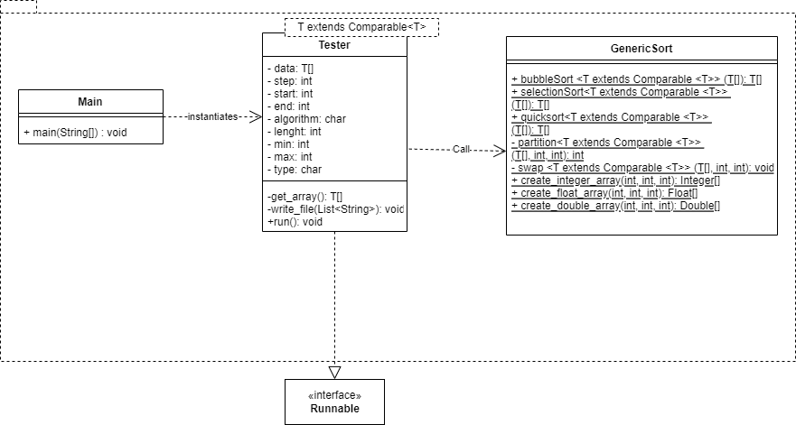
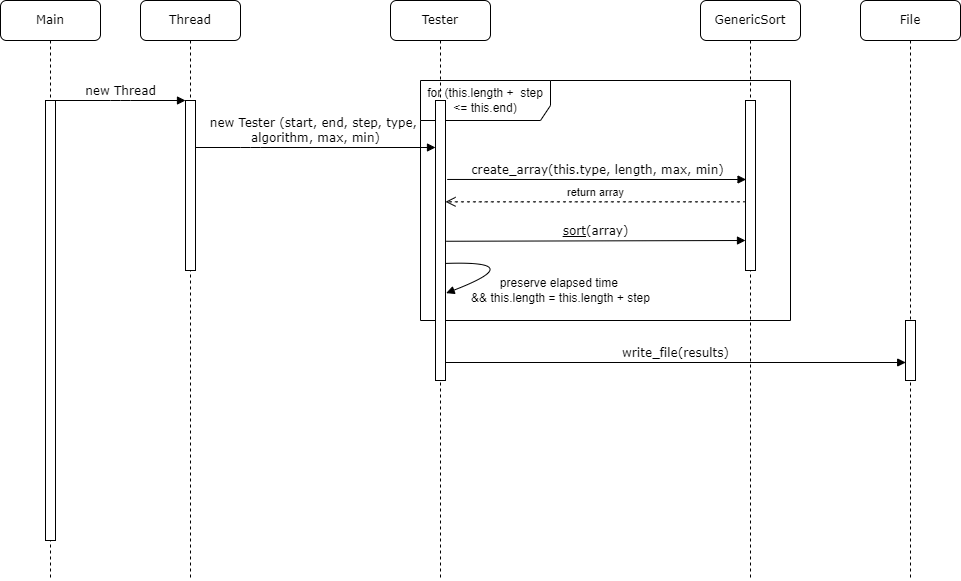

# Generic Sorting 

## Description
This project originates in an assignment in course JAV41 of AKAD University

## Goal 
The goal of this project is to
- provide a generic class for sorting primitive datatypes using three different sorting algorithms (```Quicksort```, ```Bubblesort```, ```Selectionsort```)
- test the implementation in regards to the performance of the chosen sorting algorithm depending on the amount and type of input data

## Docs

You can use ```Tester``` as implementation to run different tests on the algorithms from ```Main```





For detailled information see the ```/docs``` folder.

[Link](./docs/index.html)

## Usage


Compile : 
```
./jav41/genericsorting/src $ javac -d bin jav41/genericsorting/GenericSort.java 
``` 

Run : 
```
./jav41/genericsorting/src/bin $ java jav41.genericsorting.Main
```

or easier, both combined: 
```
jav41/genericsorting $ ./buildAndRun.sh 
```

Documentation: 
```
javadoc -d /home/development/de/akad/jav41/genericsorting/docs jav41.genericsorting
```
